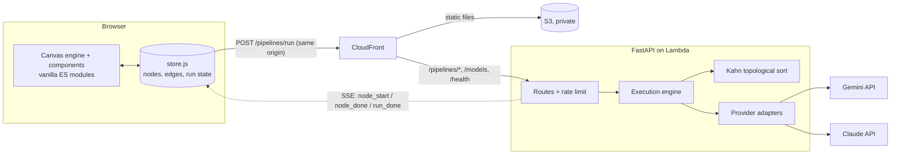
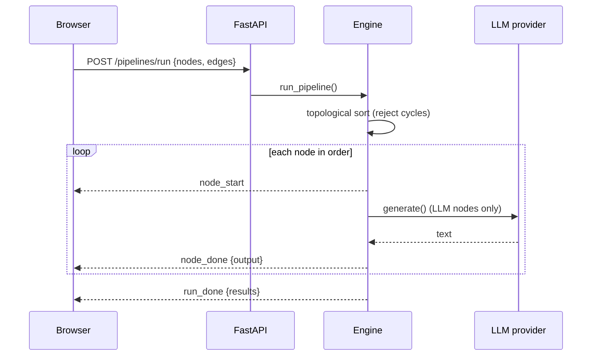

# FlowForge

**Design LLM pipelines on a canvas, validate them as a DAG, and run them with Gemini or Claude.** Results stream back node by node.

  

<!-- Add a demo GIF here: docs/demo.gif -->

> **A lightweight fork.** This is a fork of the original FlowForge by Nischalgouda (MIT). The React 18 / ReactFlow / zustand / Create React App frontend has been rewritten as plain ES modules with no npm, no build step and no third-party frontend code. The original checkout with `node_modules` was about **440 MB**; this whole repository is about **0.5 MB**, and the frontend (fonts included) is under 400 KB. There is nothing to `npm install` and nothing to `npm audit`. The UI also has a new design system, "Clay Workbench", with light and dark themes.

Everything runs behind one CloudFront distribution (see [deploy/](deploy/README.md)): the static frontend comes from a private S3 bucket and the FastAPI backend runs on AWS Lambda, reached at the same origin under `/pipelines/*`, `/models` and `/health`. Add your own key under **API Keys** to run without the shared demo keys, which are optional and rate limited per IP.

## What it does
- Drag nodes (Input, Text Template, LLM, Output, and more) onto a canvas and wire them together.
- `{{variables}}` in a Text node create input handles automatically.
- **Validate** checks the graph is a DAG (no cycles) and reports node and edge counts.
- **Run** executes the graph in topological order. Each node lights up as it runs and shows its output; LLM nodes call Gemini or Claude.
- Bring your own API keys, or use the rate-limited demo key.

## Architecture



### Run lifecycle



## Design decisions
- **Server-sent events over WebSockets.** Execution is one-way (server to client), so SSE is simpler and passes through proxies and CDNs (here, CloudFront to a streaming Lambda Function URL). The client reads the stream with `fetch` because `EventSource` is GET-only.
- **Kahn's algorithm for ordering and cycle detection.** One pass gives both the execution order and the cycle check, and unlike recursive DFS it can't hit the recursion limit on large graphs.
- **Pure graph module, thin engine.** `graph.py` has no I/O and is unit tested; `engine.py` takes a key resolver as a callback, so tests inject fakes and never touch the network.
- **Provider adapters over plain REST (`httpx`).** No vendor SDKs to pin, and adding a provider is one function.
- **Keys never touch the repo or logs.** The browser sends keys only with a run request (held in session storage); the server falls back to env-var keys behind a per-IP rate limit.
- **One `BaseNode` for every node type.** Cards, handles, delete and run-status rendering live in one place, and each node supplies only its fields.
- **Node config lives in the store, not component state,** so the backend receives exactly what is on screen.
- **No npm, no build, no third-party frontend code.** The UI is plain ES modules: pure components that return DOM from tagged template literals (`web/js/util/html.js`), a 40-line selector store, and a hand-written canvas engine (pan/zoom, drag, bezier wires, minimap). Nothing to `npm audit`; the supply chain is this repo. See [docs/vanilla-migration.md](docs/vanilla-migration.md).
- **Design tokens.** Every colour, font and shadow comes from `web/css/tokens.css` (light + dark). See [docs/design.md](docs/design.md).

## Run locally

```bash
# backend (http://localhost:8000)
cd backend
cp .env.example .env              # add GEMINI_API_KEY and/or ANTHROPIC_API_KEY
pip install -r requirements.txt
uvicorn main:app --reload

# frontend (http://localhost:8080) — static files, no install step
python3 -m http.server 8080 -d web
```

The frontend calls `http://localhost:8000` when served from localhost (override with `?api=http://host:port`, honoured on localhost only). On any other host it uses relative URLs, because the API shares the page's origin; a host page can also set `window.FF_CONFIG = { API_URL }`. Local CORS allows `http://localhost:8080` and `http://127.0.0.1:8080` (override with `ALLOWED_ORIGINS`). Review switches: `?theme=light|dark`, `?example=1`.

Or run the backend in Docker: `docker compose up --build`.

Tests:
- Backend: `cd backend && pip install -r requirements-dev.txt && pytest`
- Frontend unit tests (Node's built-in runner, no packages): `node --test web/tests/*.test.mjs`
- Browser selftests: serve `web/` and open `/dev/canvas-harness.html?selftest=1` and `/dev/app-selftest.html` (result in the page title).

## API

| Method | Path | Purpose |
|---|---|---|
| GET | `/health` | Liveness check (`{"status": "ok"}`) |
| GET | `/models` | Supported model labels |
| POST | `/pipelines/parse` | Node/edge counts and `is_dag` |
| POST | `/pipelines/run` | Execute the graph; streams SSE events |

## Deploy (AWS)

One SAM stack: private S3 bucket, CloudFront with two origins, and the API as a Lambda function (Python 3.12, arm64, [AWS Lambda Web Adapter](https://github.com/awslabs/aws-lambda-web-adapter) with response streaming) on a Function URL that only CloudFront can use (shared `x-origin-verify` secret). Optional demo keys live in SSM Parameter Store, never in the template or environment. Concurrency is capped to limit spend.

```bash
cp deploy/deploy.env.example deploy/deploy.env   # fill in profile, account, region
./deploy/set-secrets.sh                          # optional: server demo keys
./deploy/deploy.sh                               # build, deploy, publish, smoke test
```

See [deploy/README.md](deploy/README.md). Remove everything with `./deploy/teardown.sh`.

## Known limitations and roadmap
- API, Database, Filter, Validator and Transform nodes are UI-only for now; the engine passes their input through.
- Rate limiting is in-memory, per Lambda container, so it is a soft limit; a shared store (DynamoDB or Redis) would make it exact. Reserved concurrency is the hard spend cap.
- Save/load pipelines, parallel execution of independent branches, and per-node retries are next.

## Docs
- [Architecture reference](docs/architecture.html) (diagrams; open in a browser, prints to PDF) and its [pointer page](docs/architecture.md)
- [Architecture decision records](docs/adr/README.md)
- [Design system](docs/design.md) and [vanilla migration contracts](docs/vanilla-migration.md)

## License
MIT
